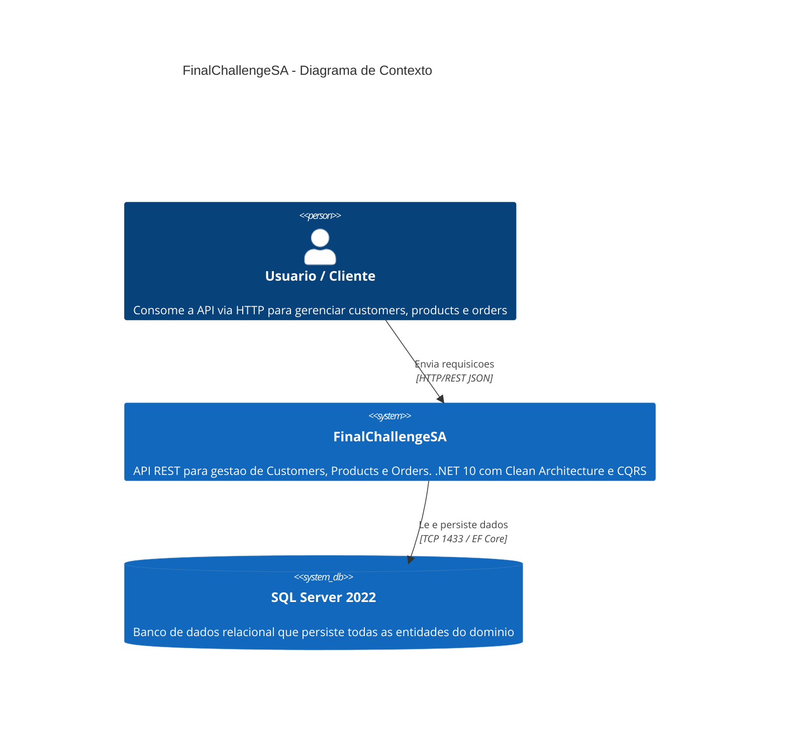
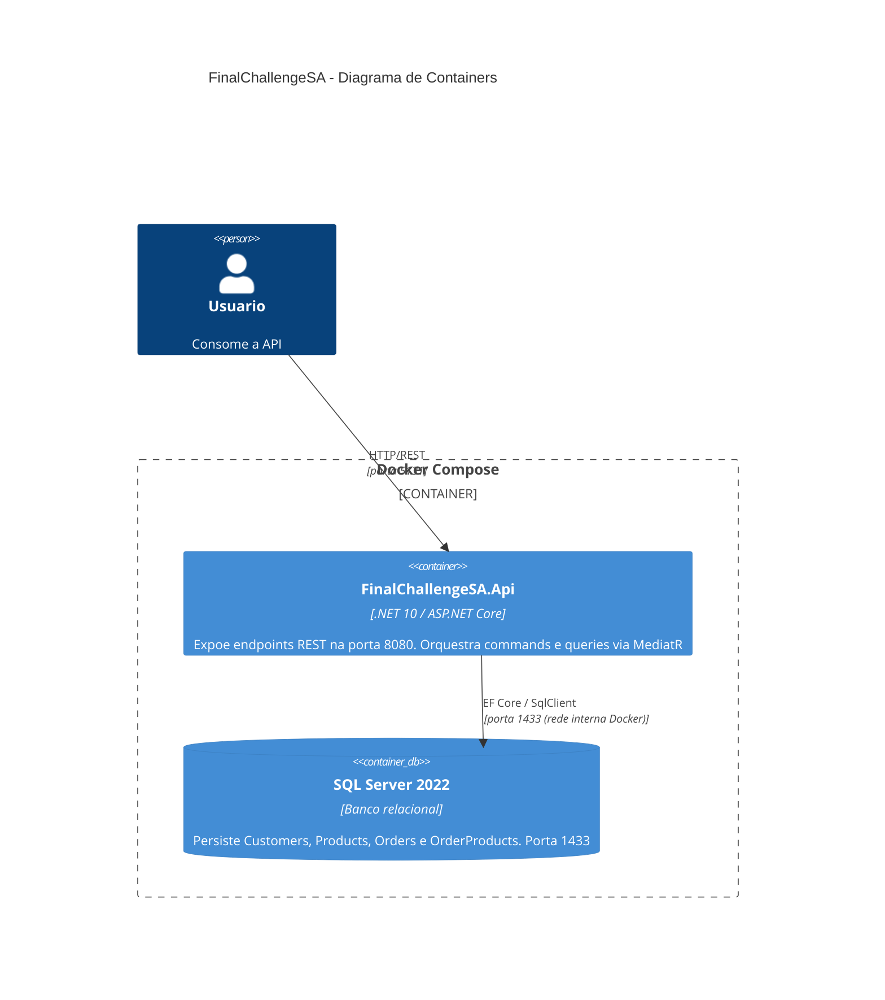
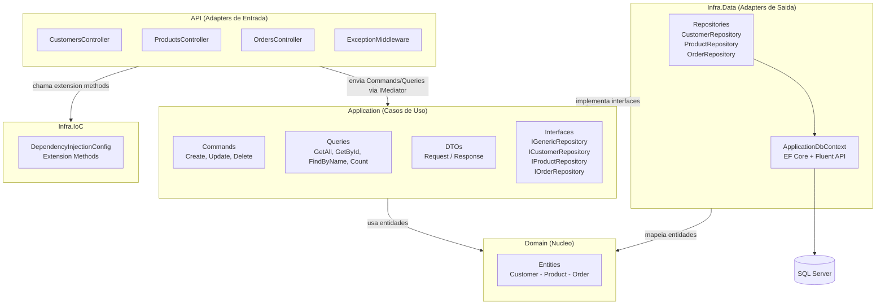
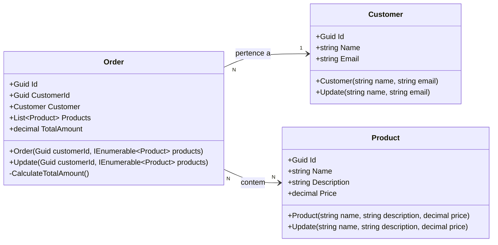
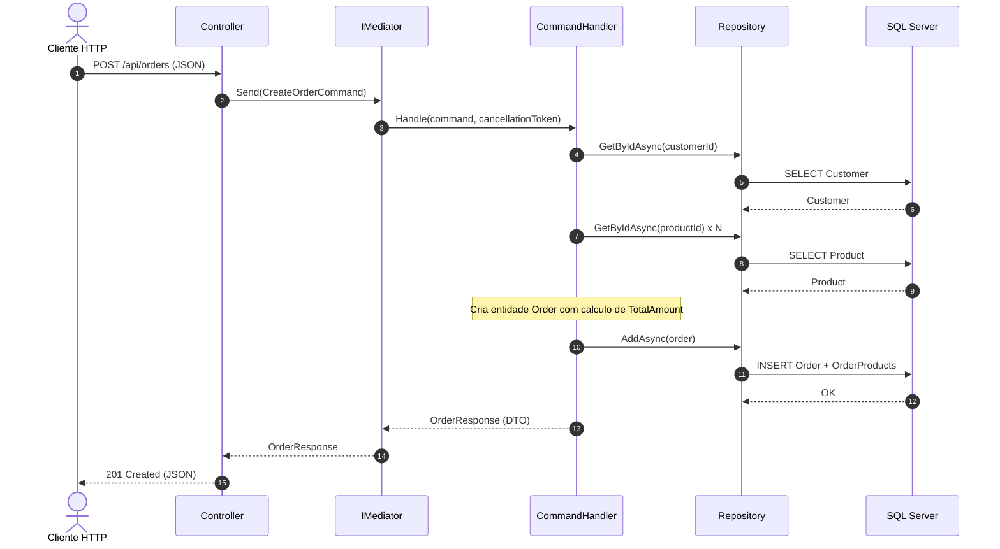

# FinalChallengeSA
 
API REST para gerenciamento de **Customers**, **Products** e **Orders**, desenvolvida em **.NET 10** seguindo principios de **Clean Architecture** com **CQRS** (Command Query Responsibility Segregation) e containerizacao via **Docker**.
 
---
 
## Sumario
 
- [Visao Geral da Arquitetura](#visao-geral-da-arquitetura)
- [Diagramas C4](#diagramas-c4)
- [Estrutura do Projeto](#estrutura-do-projeto)
- [Design Patterns Utilizados (GoF)](#design-patterns-utilizados-gof)
- [Outros Patterns Utilizados](#outros-patterns-utilizados)
- [Design Patterns (GoF) que Poderiam ser Utilizados](#design-patterns-gof-que-poderiam-ser-utilizados)
- [Diagrama de Classes - Domain](#diagrama-de-classes---domain)
- [Fluxo de uma Requisicao](#fluxo-de-uma-requisicao)
- [Como Executar](#como-executar)
- [Endpoints](#endpoints)
- [Melhorias Futuras](#melhorias-futuras)
- [Tecnologias](#tecnologias)
 
---
 
## Visao Geral da Arquitetura
 
O projeto segue **Clean Architecture**, onde as dependencias apontam sempre para o centro (Domain). Cada camada tem uma responsabilidade bem definida e so conhece as camadas mais internas:
 
```
Api  ->  Application  ->  Domain
 |            ^              ^
 |            |              |
 +->  Infra.IoC  ->  Infra.Data
```
 
- **Domain** nao conhece nenhuma outra camada. Define entidades e regras de negocio puras.
- **Application** orquestra os casos de uso via MediatR (CQRS). Depende apenas do Domain. Define as interfaces dos repositorios.
- **Infra.Data** implementa as interfaces da Application com Entity Framework Core e SQL Server. Depende de Application e Domain.
- **Infra.IoC** centraliza o registro de dependencias. Referencia Application, Domain e Infra.Data para conectar contratos as implementacoes.
- **Api** e o ponto de entrada HTTP: controllers, middlewares e configuracao do pipeline. Chama Infra.IoC para registrar os servicos.
 
---
 
## Diagramas C4
 
### Nivel 1 - Contexto
 
Visao de alto nivel: quem usa o sistema e com quais sistemas ele se comunica.
 

 
### Nivel 2 - Containers
 
Os containers que compoem o sistema e como se comunicam dentro do Docker Compose.
 

 
### Nivel 3 - Componentes
 
A arquitetura interna da aplicacao, mostrando as camadas e suas dependencias.
 

 
> **Regra de dependencia:** as setas apontam sempre para dentro. Domain nao referencia nenhum outro projeto. Application conhece apenas Domain. As interfaces dos repositorios ficam em Application (nao em Domain), seguindo o principio de Dependency Inversion — Application define os contratos, Infra.Data os implementa.
 
---
 
## Estrutura do Projeto
 
```
FinalChallengeSA/
|
|-- FinalChallengeSA.Domain/                         # Nucleo do negocio - zero dependencias externas
|   |-- Entities/
|   |   |-- Customer.cs                              # Entidade com encapsulamento via private setters
|   |   |-- Product.cs                               # Entidade com metodo Update() e construtor protegido
|   |   +-- Order.cs                                 # Entidade com calculo automatico de TotalAmount
|   +-- FinalChallengeSA.Domain.csproj
|
|-- FinalChallengeSA.Application/                    # Casos de uso e orquestracao
|   |-- Commands/                                    # Operacoes de escrita (Create, Update, Delete)
|   |   |-- Customers/
|   |   |   |-- CreateCustomer/                      # Command + Handler
|   |   |   |-- UpdateCustomer/
|   |   |   +-- DeleteCustomer/                      # Validacao de integridade referencial
|   |   |-- Orders/
|   |   |   |-- CreateOrder/
|   |   |   |-- UpdateOrder/
|   |   |   +-- DeleteOrder/
|   |   +-- Products/
|   |       |-- CreateProduct/
|   |       |-- UpdateProduct/
|   |       +-- DeleteProduct/                       # Valida se produto pertence a algum pedido
|   |-- Queries/                                     # Operacoes de leitura
|   |   |-- Customers/
|   |   |   |-- GetAllCustomers/
|   |   |   |-- GetCustomerById/
|   |   |   |-- FindCustomersByName/
|   |   |   +-- CountCustomers/
|   |   |-- Orders/
|   |   |   |-- GetAllOrders/
|   |   |   |-- GetOrderById/
|   |   |   |-- GetOrdersByCustomerIdQuery/
|   |   |   |-- FindOrdersByName/
|   |   |   +-- CountOrders/
|   |   +-- Products/
|   |       |-- GetAllProducts/
|   |       |-- GetProductById/
|   |       |-- FindProductsByName/
|   |       +-- CountProducts/
|   |-- DTOs/                                        # Objetos de transferencia (Request/Response)
|   |   |-- CustomerDTOs.cs
|   |   |-- ProductDTOs.cs
|   |   +-- OrderDTOs.cs
|   |-- Interfaces/                                  # Contratos dos repositorios
|   |   |-- IGenericRepository.cs                    # Interface generica (CRUD + Count)
|   |   |-- ICustomerRepository.cs
|   |   |-- IProductRepository.cs
|   |   +-- IOrderRepository.cs
|   +-- Exceptions/                                  # Excecoes de negocio
|       |-- NotFoundException.cs
|       +-- ValidationException.cs
|
|-- FinalChallengeSA.Infra.Data/                     # Implementacao de acesso a dados
|   |-- Context/
|   |   +-- ApplicationDbContext.cs                  # DbContext com Fluent API configuration
|   +-- Repositories/
|       |-- CustomerRepository.cs
|       |-- ProductRepository.cs
|       +-- OrderRepository.cs
|
|-- FinalChallengeSA.Infra.IoC/                      # Inversao de controle
|   +-- DependencyInjectionConfig.cs                 # Extension methods para registro de servicos
|
|-- FinalChallengeSA.Api/                            # Camada de apresentacao
|   |-- Controllers/
|   |   |-- CustomersController.cs
|   |   |-- ProductsController.cs
|   |   +-- OrdersController.cs
|   |-- Middlewares/
|   |   +-- ExceptionMiddleware.cs                   # Tratamento global (404, 409, 400)
|   |-- Program.cs                                   # Composicao do app e pipeline HTTP
|   |-- appsettings.json
|   +-- appsettings.Development.json
|
|-- FinalChallengeSA.Tests/                          # Projeto de testes
|
|-- Dockerfile                                       # Multi-stage build (SDK -> Runtime)
|-- docker-compose.yml                               # Orquestracao API + SQL Server
|-- nuget.config                                     # Feed de pacotes (.NET 10 preview)
|-- .dockerignore
+-- FinalChallengeSA.slnx
```
 
---
 
## Design Patterns Utilizados (GoF)
 
Os patterns abaixo sao catalogados no livro *"Design Patterns: Elements of Reusable Object-Oriented Software"* (Gamma, Helm, Johnson, Vlissides — Gang of Four, 1994).
 
### Mediator (Behavioral)
 
> *"Define um objeto que encapsula como um conjunto de objetos interage. Promove o acoplamento fraco ao evitar que objetos se refiram uns aos outros explicitamente."* — GoF
 
Os controllers nao conhecem os handlers diretamente. Todas as interacoes passam pelo `IMediator` (MediatR), que roteia commands e queries para o handler correspondente.
 
**Onde esta no projeto:**
- `CustomersController` envia `CreateCustomerCommand` via `IMediator.Send()` — nao conhece `CreateCustomerCommandHandler`
- Cada handler (`IRequestHandler<TRequest, TResponse>`) e registrado e resolvido pelo mediator automaticamente
 
**Por que foi escolhido:** desacopla a camada de apresentacao da logica de negocio. Adicionar um novo caso de uso nao exige alteracao nos controllers — basta criar o command/query e seu handler.
 
### Chain of Responsibility (Behavioral)
 
> *"Evita acoplar o remetente de uma requisicao ao seu receptor, dando a mais de um objeto a oportunidade de tratar a requisicao. Encadeia os objetos receptores e passa a requisicao ao longo da cadeia."* — GoF
 
O pipeline de middlewares do ASP.NET Core e uma implementacao classica desse pattern. Cada middleware decide se trata a requisicao ou a passa adiante.
 
**Onde esta no projeto:**
- `ExceptionMiddleware` e o primeiro elo — captura excecoes dos middlewares seguintes
- O pipeline segue: ExceptionMiddleware -> HttpsRedirection (condicional) -> Authorization -> Controllers
- Se nenhum middleware trata a excecao, ela propaga ate o ExceptionMiddleware que a converte em resposta HTTP
 
**Mapeamento de excecoes:**
 
| Excecao | Status Code |
|---------|-------------|
| `NotFoundException` | 404 Not Found |
| `ConflictException` | 409 Conflict |
| `ValidationException` | 400 Bad Request |
 
**Por que foi escolhido:** centraliza o tratamento de erros sem acoplar a logica de erro aos controllers. Cada middleware tem responsabilidade unica e a ordem da cadeia define a prioridade.
 
---
 
## Outros Patterns Utilizados
 
### CQRS (Command Query Responsibility Segregation)
 
Separacao explicita entre operacoes de **escrita** (Commands/) e **leitura** (Queries/). Cada operacao tem seu proprio request object e handler, evitando service classes monoliticas.
 
**Por que foi escolhido:** commands e queries evoluem independentemente. Facilita testes e respeita o Single Responsibility Principle.
 
### Repository
 
Abstrai a persistencia atras de interfaces (`IGenericRepository<T>`, `ICustomerRepository`, etc.). A Application depende dos contratos; Infra.Data implementa com EF Core.
 
**Por que foi escolhido:** isola a tecnologia de banco da logica de negocio. Possibilita trocar SQL Server por qualquer outro provider sem impactar handlers, e mockar repositorios em testes unitarios.
 
### DTO (Data Transfer Object)
 
Objetos dedicados para entrada/saida (Request/Response), separados das entidades de dominio.
 
**Por que foi escolhido:** evita expor a estrutura interna do dominio. Permite que o contrato da API evolua independentemente das entidades.
 
### Rich Domain Model
 
Entidades com **private setters** e mutacao apenas via metodos explicitos (`Update()`, construtores). `Order.CalculateTotalAmount()` e privado — o total e sempre consistente com os produtos.
 
**Por que foi escolhido:** protege invariantes de negocio. Nenhum codigo externo pode definir um TotalAmount arbitrario.
 
### Dependency Injection
 
Registro centralizado em `DependencyInjectionConfig.cs` via extension methods (`AddApplicationMediatR()`, `AddRepositories()`, `RegisterDbContext()`).
 
**Por que foi escolhido:** promove baixo acoplamento e mantem o `Program.cs` limpo.
 
---
 
## Design Patterns (GoF) que Poderiam ser Utilizados
 
### Observer (Behavioral)
 
> *"Define uma dependencia um-para-muitos entre objetos, de modo que quando um muda de estado, todos os dependentes sao notificados."* — GoF
 
**Onde aplicaria:** Domain Events. Apos criar um pedido, um evento `OrderCreated` notificaria observers interessados (auditoria, notificacoes, cache invalidation) sem acoplar esses side effects ao handler de criacao.
 
### Facade (Structural)
 
> *"Fornece uma interface unificada para um conjunto de interfaces em um subsistema."* — GoF
 
**Onde aplicaria:** para operacoes que envolvem multiplos repositorios (ex: criar order exige buscar customer + products + persistir order). Um `OrderFacade` simplificaria essa orquestracao, oferecendo um metodo unico `CriarPedidoAsync()` que coordena todos os passos internamente.
 
### Decorator (Structural)
 
> *"Anexa responsabilidades adicionais a um objeto dinamicamente."* — GoF
 
**Onde aplicaria:** Pipeline Behaviors do MediatR sao decorators. Um `ValidationBehavior<TRequest, TResponse>` envolveria cada handler, executando FluentValidation antes da logica principal. Um `LoggingBehavior` adicionaria logging automatico. Cada behavior e um decorator empilhado ao redor do handler original, sem modifica-lo.
 
---
 
## Diagrama de Classes - Domain
 

 
O relacionamento **Order-Product** e muitos-para-muitos, mapeado via tabela de juncao `OrderProducts` no banco de dados. O `DeleteBehavior.Restrict` em **Order-Customer** impede a exclusao de um customer que possua pedidos vinculados.
 
---
 
## Fluxo de uma Requisicao
 
O diagrama abaixo ilustra o fluxo completo de criacao de um pedido, desde a requisicao HTTP ate a persistencia no banco:
 

 
---
 
## Como Executar
 
### Com Docker (recomendado)
 
```bash
docker-compose up --build
```
 
| Servico | URL |
|---------|-----|
| API | http://localhost:5131 |
| Swagger UI | http://localhost:5131/swagger |
| SQL Server | localhost:1433 |
 
Credenciais do SQL Server (desenvolvimento):
- **User:** sa
- **Password:** Your_strong_Password123!
 
O banco de dados e criado automaticamente na inicializacao da API via `EnsureCreated()`.
 
### Localmente (sem Docker)
 
Pre-requisitos: **.NET 10 SDK** e **SQL Server** rodando localmente.
 
1. Configure a connection string em `appsettings.Development.json`:
```json
{
  "ConnectionStrings": {
    "DefaultConnection": "Server=localhost;Database=FinalChallengeSA;User Id=sa;Password=SuaSenha;TrustServerCertificate=True"
  }
}
```
 
2. Execute:
```bash
dotnet restore
dotnet run --project FinalChallengeSA.Api
```
 
---
 
## Endpoints
 
### Customers
 
| Metodo | Rota | Descricao |
|--------|------|-----------|
| `POST` | `/api/customers` | Criar customer |
| `GET` | `/api/customers` | Listar todos |
| `GET` | `/api/customers/{id}` | Buscar por ID |
| `GET` | `/api/customers/name/{name}` | Buscar por nome |
| `GET` | `/api/customers/count` | Contagem total |
| `PUT` | `/api/customers/{id}` | Atualizar |
| `DELETE` | `/api/customers/{id}` | Remover |
 
### Products
 
| Metodo | Rota | Descricao |
|--------|------|-----------|
| `POST` | `/api/products` | Criar product |
| `GET` | `/api/products` | Listar todos |
| `GET` | `/api/products/{id}` | Buscar por ID |
| `GET` | `/api/products/name/{name}` | Buscar por nome |
| `GET` | `/api/products/count` | Contagem total |
| `PUT` | `/api/products/{id}` | Atualizar |
| `DELETE` | `/api/products/{id}` | Remover |
 
### Orders
 
| Metodo | Rota | Descricao |
|--------|------|-----------|
| `POST` | `/api/orders` | Criar order |
| `GET` | `/api/orders` | Listar todos |
| `GET` | `/api/orders/{id}` | Buscar por ID |
| `GET` | `/api/orders/by-customer/{customerId}` | Buscar por customer |
| `GET` | `/api/orders/count` | Contagem total |
| `PUT` | `/api/orders/{id}` | Atualizar |
| `DELETE` | `/api/orders/{id}` | Remover |
 
---
 
## Melhorias Futuras
 
As seguintes melhorias foram planejadas mas nao implementadas por restricao de tempo:
 
- **Unit Tests por projeto:** testes unitarios cobrindo cada camada individualmente. Entidades do Domain (validacao de invariantes, calculo de TotalAmount), command/query handlers da Application (com repositorios mockados), e validacao de mapeamento em Infra.Data
- **Projeto de Automation Tests:** projeto separado de testes de integracao executando contra a API real via Docker, validando o fluxo completo desde requisicoes HTTP ate o banco de dados
- **FluentValidation + Pipeline Behavior:** validacao automatica de input em todos os commands atraves de um `ValidationBehavior`, eliminando validacao manual nos handlers
- **Domain Events:** eventos para desacoplar side effects das operacoes principais (notificacoes, auditoria, cache invalidation)
- **Paginacao:** suporte a paginacao nas queries de listagem para cenarios com grandes volumes de dados
 
---
 
## Tecnologias
 
| Tecnologia | Versao | Uso |
|------------|--------|-----|
| .NET / ASP.NET Core | 10.0 | Framework da API |
| Entity Framework Core | 10.0 | ORM e acesso a dados |
| SQL Server | 2022 | Banco de dados relacional |
| MediatR | 14.1 | Implementacao do Mediator/CQRS |
| FluentValidation | 11.3 | Validacao de input |
| Docker / Docker Compose | - | Containerizacao e orquestracao |
| Swagger / OpenAPI | - | Documentacao interativa da API |
 
